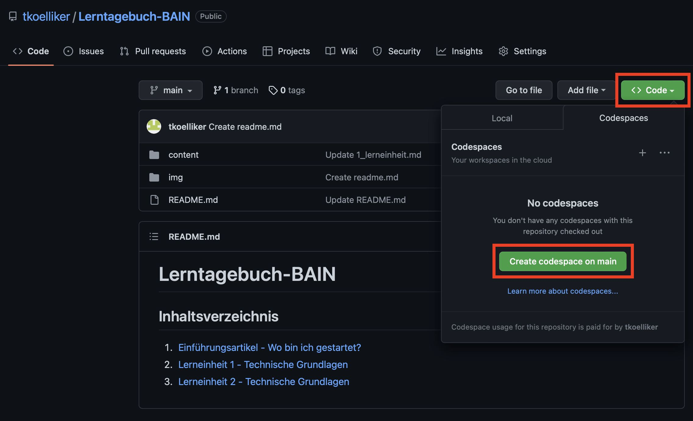

# 2. Lerneinheit

## Technische Grundlagen

Liebes Tagebuch

Gleich anschliessend an die erste Unterrichtseinheit starteten wir am Nachmittag mit dem zweiten Teil der Lerneinheit _Technische Grundlagen_. Diese widmet sich hauptsächlich GitHub, GitHub Codespaces, der Unix Shell sowie der Erstellung von diesem Tagebuch.

### GitHub
Für den Unterricht hat der Dozent vorgeschlagen, GitHub zu verwenden. Ich hatte in zwei vorherigen Modulen bereits mit GitHub gearbeitet, hatte somit bereits ein Login und kenne es ein wenig. Wir haben in den anderen Modulen jedoch Lokal (ich mit Visual Studio Code) gecoded und die Änderungen jeweils auf GitHub Comitted, damit die Gruppe mit der aktuellen Version weiterarbeiten konnte. Ich war jeweils froh, dass es immer funktioniert hatte, die Einrichtung von Git bei Visual Studio Code war teilweise Glückssache. Ich finde es jedoch toll, dass wir noch einmal vertiefter damit arbeiten, denn ich finde es ein cooles Tool, welches auch weit verbreitet ist. Dies zu beherrschen oder auch nur schon, wenn man weiss wie damit umzugehen, hilft sehr. 

### GitHub Codespaces
GitHub Codespaces kannte ich nicht und war neu für mich. Codespaces sind Programmierumgebungen, welche in der Cloud gehosted werden. Mehr kannst du erfahren unter [Übersicht über GitHub Codespaces](https://docs.github.com/de/codespaces/overview). Es ist sehr nah an Visual Studio Code angelehnt und ich mich gut zurecht finden konnte. Ein weiterer Vorteil ist, dass man GitHub Codespaces bis zu 60 Stunden pro Monat gratis nutzen kann.

Wenn man GitHub Codespaces benutzen möchte, muss man im Projekt, welches bearbeitet werden soll auf _Code_ und anschliessend _Codespaces_, _Create codespace on main_ geklickt werden. Es öffnet sich ein neues Fenster mit dem Codespace

### Unix Shell
Im GitHub Codespace nutzten wir die Gelegenheit, noch einmal die Grundlagen der Unix Shell zu repetieren. Ich hatte die Shell bereits im Modul ARIS (Architektur von Informationssystemen) genutzt. Da dies jedoch schon zwei Jahre her ist und ich die Befehle seither nicht mehr genutzt habe, war ich froh um eine Repetition. 

Als ersten hatten wir eine kurze Einfürhung durch den Dozenten, anschliessend durften wir [Übungen](https://librarycarpentry.org/lc-shell/) selbständig erledigen 

[Ein kleiner Spick-Zettel der Shell](https://librarycarpentry.org/lc-shell/reference.html)

### Erstellung Lerntagebuch
Zum Schluss der Unterrichtseinheit durften wir uns überlegen, wie wir das Lerntagebuch führen wollen und es anschliessend aufsetzen. Für mich gab es zwei Optionen: entweder ich nutze GitHub für das Lerntagebuch oder HedgeDoc. GitHub wäre für mich ein wenig Herausfordernder, da ich GitHub nur in Kombination mit Visual Studio Code. HedgeDoc wäre für die Erstellung einfacher, obwohl ich doch zuerst schauen musste, wie man es am besten erstellen würde, damit die Einträge bei der Demoversion nicht verloren gehen. Schlussendlich habe ich mich für GitHub entschieden, da ich denke, dass ich mehr von diesem Tool profitieren werde, auch wenn das Aufsetzen aufwendiger war. Wie man das Projekt auf GitHub erstellt war zu Beginn für mich nicht klar. Nur schon beim Erstellen eines Ordners hatte ich ein wenig Mühe. Nach ein wenig Googeln und Austausch mit dem Dozenten und Studierenden, habe ich es geschafft, das Tagebuch aufzusetzen und via einer URL zugänglich zu machen. 

Dann wären wir auch schon beim Abschluss. Machs gut liebes Tagebuch

[Zurück zur Übersicht ›](../RADME.md)
