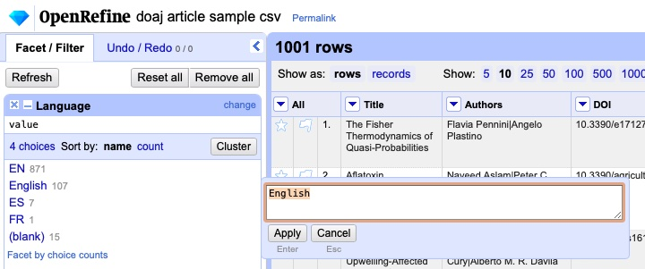
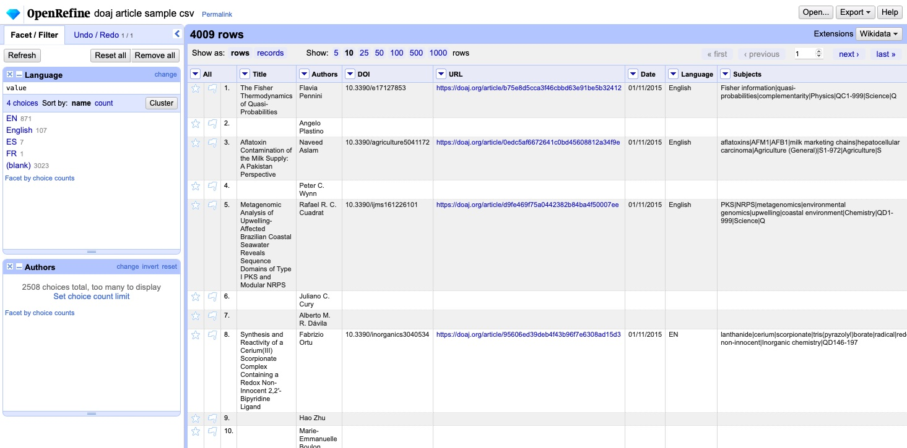
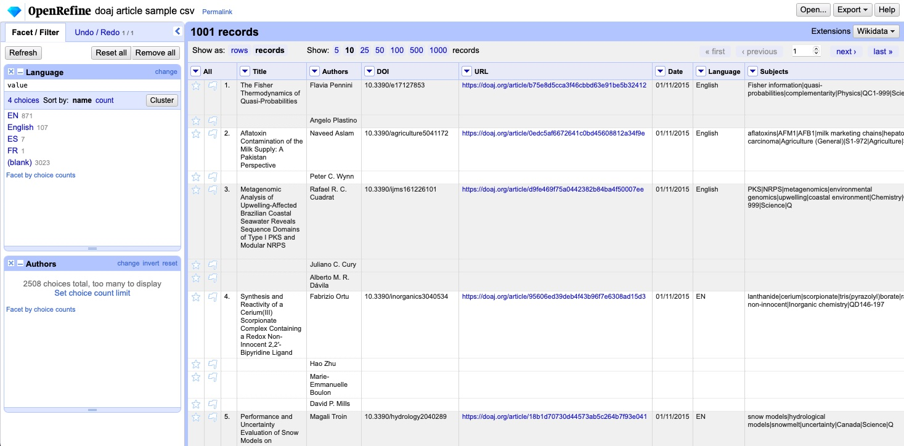
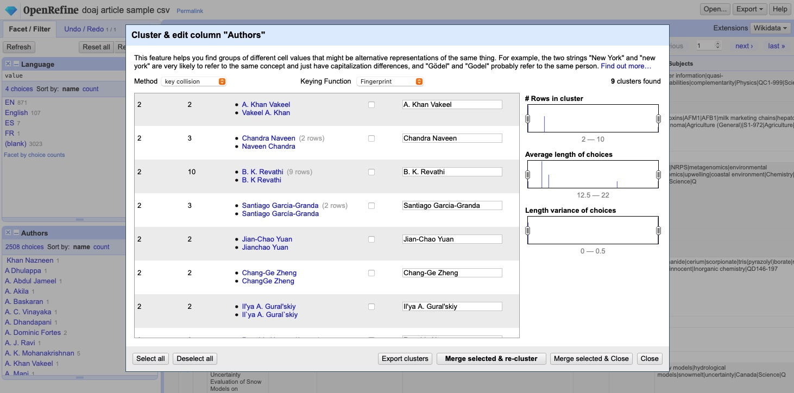

# 3. Lerneinheit

## OpenRefine

Liebes Tagebuch

Die dritte Unterrichtseinheit behandelte das Thema OpenRefine. OpenRefine ist eine Open Source Software, welche dazu dient, mit «messy» Daten zu arbeiten. Zuerst gibt es jedoch drei Literaturtipps vom Dozenten: [Library Carpentry Lessons](https://librarycarpentry.org/lessons/), [Programming Historian Lessons](https://programminghistorian.org/en/lessons/), [Handbuch IT in Bibliotheken](https://it-in-bibliotheken.de)

### Was ist OpenRefine? 

[OpenRefine](https://openrefine.org) ist wie oben beschrieben, eine Open Source Software, welche für unordentlichen Daten nützlich ist. Ich kann es mir am besten vorstellen, dass es sehr ähnlich ist wie Excel, jedoch besser die Daten bereinigen und vereinheitlich kann. Es ist v.a. für sehr grosse Datensätze geeignet. OpenRefine nimmt jeweils an, dass Daten importiert werden, welche man anschliessend wieder exportieren kann. Die Features von OpenRefine sind:

**Faceting** - Man kann damit einen Teilbestand der Daten anschauen. Es ist eine Art Suchmaschine mit Daten und Filterung. 

**Clustering** - Inkonsistenz der Daten beheben. Dadurch kann ein Algorithmus ähnliche Daten zusammenfügen und man kann z.B. unterschiedliche Schreibweisen von Namen anschauen und ausbessern.

**Reconciliation** - Damit kann das Programm Datensätze zusammenführen. 

**Infinite undo/redo** - Alles wird protokolliert, was gemacht wird. Dies dient als Einstieg in die Automatisierung. Die History ist jedoch nur zugänglich, wenn das Projekt spezifisch gespeichert wird.

**Privacy** - Die Privatsphäre ist gegeben, weil die Daten auf einer lokalen Maschine bleiben und es kein Internet benötigt. Es wird nur der Webbrowser benutzt, welcher auf den lokalen Port verweist. Dadurch kann das Programm auch gut für private oder vertrauenswürdige Daten benutzt werden. 

**Wikibase** - Das Programm ist Open Source und dadurch ist das Wissen (Code) frei zugänglich und jede:r kann zugreifen und editieren.

Das Programm ist in sehr breitem Einsatz (was mich erstaunt hat). Wir haben die Einsatzgebiete angeschaut und es wird nicht nur im Bibliotheks-/Archivsbereich eingesetzt. Am meisten werden die beiden Features «Cleaning and normalizing data» sowie «Datentransformation» durchgeführt. 

### Hilfreiche Features
(welche Excel nicht kann)

Ich fand es sehr spannend, mit OpenRefine zu arbeiten. Ich kenne mich gut mit Excel aus und mag das Programm. Excel kann teilweise sehr hilfreich für die Arbeit sein und ich benutzte es oft, um Daten zu organisieren, strukturieren und zusammenführen. Darum nahm es mich Wunder, was OpenRefine zusätzlich zu Excel machen kann. 

Was mich sehr verwundert hat, war die schnelle find/replace-Funktion, welche jedoch bei OpenRefine anders gehandhabt wird. Man kann Textfacetten anzeigen lassen, und diese ändern. So beispielsweise von Englisch auf EN. Dabei kann man den Text von dieser Facette sehr unkompliziert ändern. 

Ein weiteres Feature, welches mich sehr beeindruckt hat war, die «Split multi-valued cells in colum» Funktion. Dabei konnte ich definieren, welches Trennzeichen die Daten trennen soll (in diesem Beispiel die Autoren). Dies ist nicht sehr speziell was jedoch cool ist, ist dass diese Autoren trotzdem noch zum eigentlichen Datensatz gehören. Wenn _rows_ angewählt ist, dann werden alle einzelnen Einträge (also alle einzelnen Autoren) aufgeführt. Ändert man es in _records_, dann werden die Reihen gruppiert und dadurch werden sie wieder zu einem Datensatz. 

Auch enorm hilfreich sehe ich die Empfehlung des Clusterings von Namen. So gibt es beispielsweise bei den Autoren unterschiedliche schreibweisen von Namen (z.B. B. K. Revathi vs. B. K Revathi). Es ist klar, dass das der gleiche Autor ist, jedoch anders geschrieben. Mittels OpenRefine erkennt man diese «Fehler» und kann sie sehr einfach zusammenführen (es gibt dir sogar Vorschläge, welchen Namen genutzt werden soll – jeweils der häufigere). Dieses Feature sehe ich als einen sehr grossen Vorteil bei der Bereinigung von Daten. 

Das wäre das Thema OpenRefine gewesen – Sehr spannend und es gibt viele Vorteile gegenüber von Excel!

[‹ Zurück zur Übersicht](../README.md)

