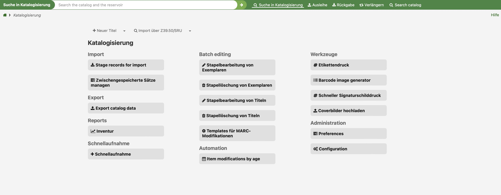
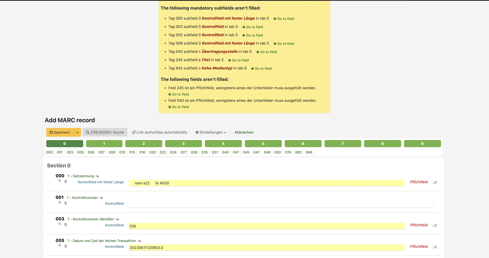

# 4. Lerneinheit

## Funktion und Aufbau von Bibliothekssystemen 1/2

Liebes Tagebuch

Wir sind in das Thema _Funktion und Aufbau von Bibliothekssystem_ eingestiegen. Wir schauen das Thema in dieser und in der nächsten Lerneinheit am Beispiel vom Open Source Programm _Koha_ an. Zuerst jedoch einen kurzen Einblick in den Metadaten-Standard MARC21.

### MARC21
Ich hatte MARC21 kurz in einem anderen Modul im ersten Lehrjahr, danach jedoch nicht mehr. Da ich auch nicht in einer Bibliothek arbeite, kenne ich es nicht und habe auch keine Vorkenntnisse. Ich fand es gut, einen zweiten Einblick in den Metadaten-Standard zu erhalten. Auch der Vergleich mit Dublin Core fand ich sehr spannend. So konnte ich mich ein wenig mit den beiden Schreibweisen auseinandersetzen und fand es spannend, wie kompliziert und unklar mir MARC21 im Vergleich zu Dublin Core erscheint. Bei MARC21 gibt es hauptsächlich Codierungen (welche ich mit dem Handbuch entziffern musste) wogegen Dublin Core sprechende Feldnamen benutzt, welche ich als Laie verstand. 

Ich fand Dublin Core verständlicher und auch sympathischer, kann jedoch verstehen, warum MARC21 der Standard ist. Es gibt viel mehr Möglichkeiten für die Erfassung und ist schon lange im Gebrauch. Einen solchen Standard abzulösen ist sicherlich sehr aufwändig, obwohl sicherlich auch viel Potenzial bestehen würde. 

### Koha
Koha ist ein Open Source Programm, welches von einer grossen Community weiterentwickelt wird. Wir konnten Koha auf einer [öffentlichen Demo](https://koha.adminkuhn.ch:8443) testen. Auf dieser Demo kann / darf man alles machen, was geht, denn das Programm wird jeweils am Morgen wieder zurückgesetzt. Ich finde dies sehr cool, denn so kann man testen, wie das Programm läuft und ob es alle Requirements erfüllt, die man an das System hat, ohne Aufwand in die Installation zu stecken. 

Ich fokussiere mich noch genauer zu einigen Punkte bezüglich der Usability, welche mir bei Koha aufgefallen sind. Da ich kein Vorwissen von Bibliothekssystemen habe, fand ich es interessant, wie intuitiv ich bestimmte Punkte fand (oder eben nicht). Zu Beginn bei der Erstellung von einem neuen Titel musste ich sehr lange suchen, bis ich nur schon den Button _Neuer Titel_ gefunden habe, da dieser, im Gegensatz zu den anderen Buttons, sehr klein und unscheinbar ist. Diesen wäre besser als Primary Button dargestellt, da beim Thema Katalogisierung die Erfassung ja eine zentrale Rolle darstellt. Gleich danach kommt vermutlich mein Lieblingsfeature. Wenn man bei einigen obligatorischen Feldern reinklickt, kommt ein Dummy-Eintrag, wodurch es das Testing sehr stark erleichtert und schneller macht. Auch das Feedback ist sehr gut, denn es zeigt mir genau an, wo noch etwas fehlt inkl. Link zum Feld und Nummer, weswegen ich nicht alles durchklicken muss, bis ich das noch auszufüllende Feld finde.

Danach hatte ich ziemlich Mühe, um im System das Buch ausleihen zu können. Ich wollte nach dem Buchnamen suchen, dieser wurde jedoch nicht angezeigt. Bis ich herausgefunden habe, dass ich zuerst auf das Benutzerkonto gehen und da den Barcode eingeben muss, verging einige Zeit. Da wäre sicherlich eine Schritt für Schritt Anleitung geeignet, wo den Anwender durch das Prozedere durchführt. Dabei fiel mir auf, dass es sehr viele Optionen gibt, und es für mich sehr unübersichtlich wirkt. Wenn ich was finden wollte gab es einige Möglichkeiten (_Ausleihe_ kann man z.B. über den Header erreichen oder als Button). Ausserdem ist es sehr verschachtelt, was ich als Anfängerin sehr überfordernd finde. Bei der Ausleihe und bei der Rückgabe fehlte mir das Feedback vom System. Ich wusste bei beidem nicht genau, ob es nun wirklich erfolgreich war, da ich nie etwas bestätigen musste. Da überlegte ich mir auch, ob das nicht sehr Fehleranfälltig sein kann, wenn man nie bestätigen muss oder die Kontrolle erhält, dass man das richtige Ausgeliehen / Zurückgegeben hat. Da würde ich mir mehr Feedback vom System wünschen.

Jetzt sind wir auch bereits am Ende angelangt ... beim nächsten Eintrag gibt es mehr zu Koha - dann zum Datenimport und -export ;-)

[Zurück zur Übersicht ›](../README.md)
