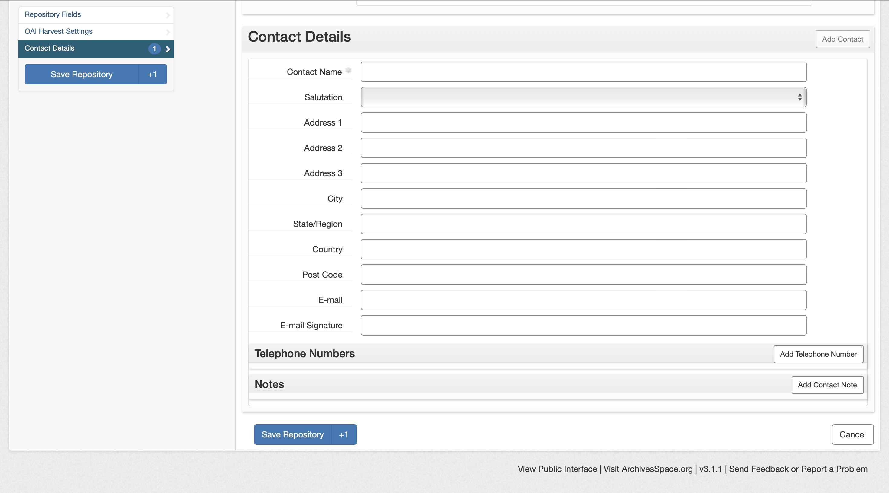
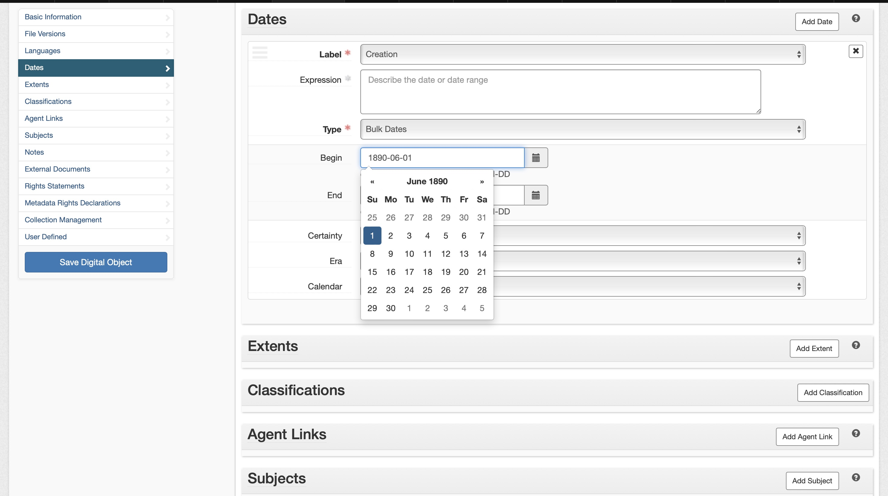

# 6. Lerneinheit

## Funktion und Aufbau von Archivsystemen

Liebes Tagebuch

Die letzten zwei Unterrichtseinheiten waren über Bibliothekssysteme, heute kamen die Archivsysteme zum Einsatz. Zuerst gab es einen kurzen Überblick über die Unterschiede zwischen des Archivs und der Bibliothek (und dessen Systemen). Anschliessend haben wir zwei Archivkataloge untersucht und schlussendlich beim Archivsystem _ArchivesSpace_ selber Einträge hinzugefügt.

### Unterschied Archiv / Bibliothek
Um die Logik der Archivsysteme zu verstehen, wurden zuerst die Unterschiede zur Bibliothek und dessen Systeme angeschaut. Dabei sind mir diese zwei Punkte aufgefallen:
* Findbuch vs. Katalogkasten: Beim Archiv wurde früher (vor den IT-Systemen) ein Findbuch eingesetzt, um die Inhalte im Archiv zu finden. Bei der Bibliothek wurden Zettelkästen eingesetzt. Der unterschied dabei war, dass Zettelkästen / Katalogkasten immer nach der gleichen Struktur aufgeführt werden konnten, ein Findbuch jedoch nicht, da das Archiv sehr unterschiedliche Ressourcen hat. 
* Da kommen wir auch schon zum zweiten Punkt: Das Archiv hat sehr unterschiedliche Bestände, was das Erfassen schwieriger gestaltet. Die Bibliothek kann strukturierter vorgehen. 
Spannend finde ich, dass man schon früher beim Findbuch / Katalogkasten die Unterschiede sieht, welche heute in den Softwaren zu sehen sind. Grundsätzlich logisch, trotzdem hab ich mir das so noch nie überlegt.

### Vergleich Archivkataloge
Weiter haben wir zwei Archivkataloge [Staatsarchiv Basel-Stadt]( https://dls.staatsarchiv.bs.ch/records/458841) und [Hochschularchiv ETH Zürich](http://archivdatenbank-online.ethz.ch/hsa/#/) verglichen und geschaut, wie unter anderem der ISAD(G) Standard erkennbar ist. 

Ich komme nicht aus dem Archiv-Bereich, weswegen es für mich zuerst schwierig war, zu wissen welche Daten was bedeutet und für was benötigt wird. Ich habe mich unter anderem auf die Provenienz fokussiert und geschaut, bei welcher Ressource diese vorhanden ist. Ich fand sie jedoch bei keinem Dossiert. Dies hat mich ein wenig verwirrt, da im Unterricht mitgeteilt wurde, dass die Provenienz obligatorisch ist. Es wurde im Plenum mitgeteilt, dass grundsätzlich die Provenienz beim Bestand notiert wird und nicht bei jedem einzelnen Dossier. Das leuchtet mir ein, aber die Frage ist immer noch, warum man bei der Erfassung ein obligatorisches Feld leer lassen kann? 

### ArchivesSpace

Beim ArchiveSpace konnten wir schlussendlich noch mit ein Archivsystem arbeiten. Da ich noch nie eines gesehen oder benutzt habe, fand ich es sehr interessant. Auch im Vergleich zum Bibliothekssystem Koha. Ich gehe hier wieder detaillierter auf die Benutzerfreundlichkeit ein. 

Kurz noch zu einem für mich persönlich sehr cooles Feature: die Speichern Funktion mit integrierten «add more» Element. Ich kann mir vorstellen, wenn man viele Bestände erfassen muss, ist das bestimmt ein wertvolles Feature.

Weiter ist mir aufgefallen, dass die Übersichtlichkeit bei ArchivesSpace meiner Meinung nach Übersichtlicher ist als bei Koha. Nur schon das Erfassen einer neuen Ressource fand ich sofort, wohingegen ich bei Koha sehr viel Suchen musste. Auch den Reiter auf der Seite welcher eine Art «Inhaltsverzeichnis» darstellt ist für die Orientierung wertvoll. Ich finde diese Baumstruktur übersichtlicher als die Tab-Version bei Koha. Ein weiteres sehr verständliches und hilfreiches Feature war der Kalender. Ich konnte da sehr einfach auf Jahrhunderte zurückgreifen und mich anschliessend zum entsprechenden Datum navigieren – sehr schnell und intuitiv. 

[Zurück zur Übersicht ›](../README.md)
