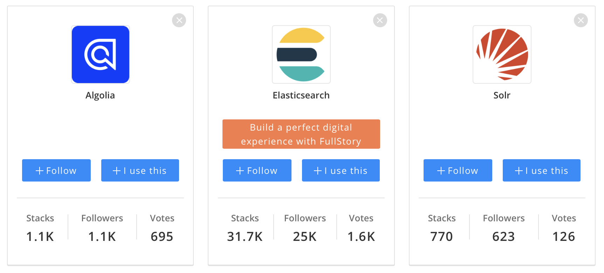

# 9. Lerneinheit

## Suchmaschinen und Discovery-Systeme

Liebes Tagebuch

Das Thema heute ist Suchmaschinen und Discovery-System. Wir haben uns in der Lehreinheit vertieft VuFind und Solr angeschaut. Es ging darum, welche Funktionen die Systeme haben, unter anderem mit einem Vergleich. Anschliessend möchte ich in diesem Tagebuch das System Solr vertiefen und mit Algolia und Elasticsearch vergleichen. 

### Solr und VuFind
Solr schreibt auf ihrer Seite «Solr powers the search and navigation features of many of the world's largest internet sites.». Das bedeutet, Solr ist für die Suche auf Webseiten zuständig. Es bietet verteilte Indizierung, Replikation und lastverteilte Abfrage sowie automatisierte Ausfallsicherung und Wiederherstellung – und mehr. 

VuFind ist «ein Portal für Bibliotheksressourcen, welches von Bibliotheken für Bibliotheken konzipiert und entwickelt wurde». Es gibt den Benutzer:innen die Möglichkeit, im Bibliothekskatalog zu suchen und zu stöbern. Weil es ein Open Source Programm ist, kann man die Module den Bedürfnissen entsprechend anpassen oder hinzufügen.

Zusammen ergibt sich einen Bibliothekskatalog mit einer fortschrittlichen und individuellen Suche. 

### Vergleich Solr und VuFind
Beim Vergleich dieser zwei Systemen sieht man schon sehr schnell, dass VuFind eine schöne UI hat, wohingegen Solr technisch aufgestellt ist. Man muss wissen, wie man Solr benutzen muss, denn ohne Handbuch oder Vorwissen ist es nur schon sehr schwierig, eine einfache Suchabfrage zu machen. So sieht man beispielsweise unten, dass die Sucheingabe beim q erfolgen muss und eingeben muss man ```allfields:psychology``` - nicht sehr intuitiv. Was ich sehr cool fand ist, dass der «Writer Type» unterschiedliche Formate ausgeben kann.


VuFind hat viele (UI-)Vorteile wie beispielsweise die Facettensuche. Bei VuFind ist diese Suche sehr gut ausgebaut. Was auch cool ist und ein Zusammenspiel mit Solr ist, ist das Highlighting (siehe Bild unten). Ausserdem gibt es Zusatzfeatures wie Teilen, Zitieren und Drucken, was für ein Bibliothekskatalog sicher hilfreich ist.


Das Ranking ist bei beiden Systemen gleich, weil VuFind das Ranking, so wie ich es verstanden hab, von Solr nimmt. Wir haben das Rankingverfahren noch detailierter angeschaut. Einen Ausschnitt daraus findest du unten im Bild.


### Solr, Algolia und Elasticsearch
Nun möchte ich jedoch gerne Solr mit anderen Systemen kritisch vergleichen. Bei uns im Unternehmen setzen wir neu Algolia auf der Webseite als Suchmaschine ein. Es wurde ausgiebig getestet (leider war ich bei der Evaluation nicht dabei), welche Suchmaschine unseren Bedürfnissen am besten entspricht und Algolia war der Gewinner.

Bei [Stackoverflow](https://stackoverflow.com/questions/26484394/algolia-vs-solr-search) gab es einen Beitrag, ob man besser Solr oder Algolia verwenden soll. Algolia sei im Vergleich zu Solr viel schneller und hat mächtige Features. Ausserdem steht einem ein Dashboard für die Verwaltung zur Verfügung. Solr sei gemäss diesem Beitrag «okay but also a black box». Man könne die Suchmaschine gut abstimmen, aber es hat schlechte Resultate für die Semantische Suche. Jedoch könne man mit Solr die Suche besser personalisieren, es sei aber zeitaufwändig. Im Beitrag wird eher Algolia oder Elasticsearch für die Implementierung empfohlen als Solr. 



Gemäss [SaaS worthy](https://www.saasworthy.com/compare/algolia-site-search-vs-apache-solr-vs-elasticsearch?pIds=3328,3386,3415) haben Algolia und Elasticsearch sehr ähnliche Featrues. In einem [Artikel von Medium](https://medium.com/@matayoshi.mariano/elasticsearch-vs-algolia-96364f5567a3) wird Algolia mit Elasticsearch verglichen. Dabei ist Elasticsearch im Vergleich zu Algolia günstiger (wenn viele Einträge indexiert werden müssen), jedoch schwieriger zu implementieren und mehr Know-How ist relevant. 

Ich denke die einzelnen Systeme sind abhängig von den Anforderungen. Solr ist das einzige Open Source Programm der dreien. Trotzdem haben die anderen sicherlich mehr Vorteile – sind jedoch auch teurer. 

[‹ Zurück zur Übersicht](../README.md)
